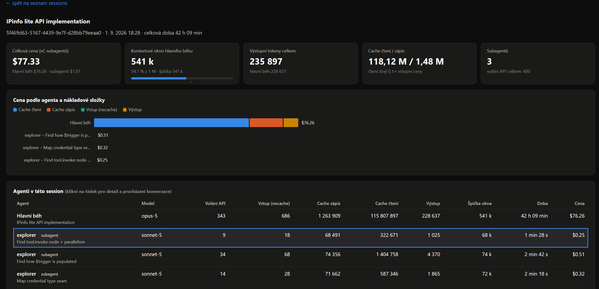
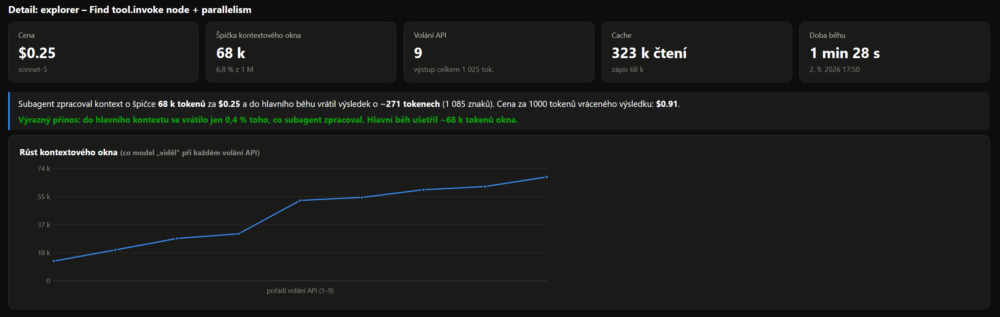
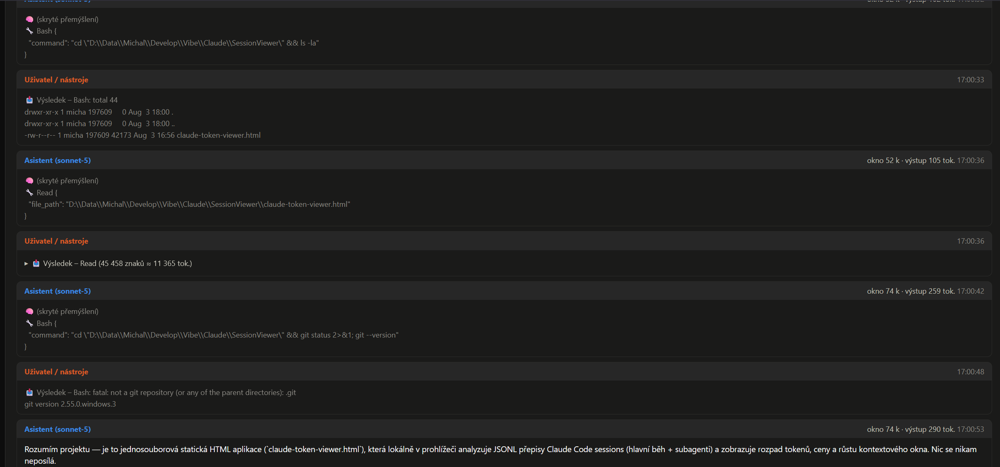

# Claude Session Viewer

A simple, single-file web app for analyzing token usage and cost in [Claude Code](https://claude.com/claude-code) session transcripts – including any subagents spawned during the session.

The whole app runs **entirely in your browser** (no backend, nothing is ever sent to a server) – files are read directly from disk using the browser's File API.

## What it's for

Claude Code stores the history of every conversation (session) as a `.jsonl` file, along with transcripts of any subagents spawned during that session. This app loads those files and shows:

- **Session overview** for a given project folder (title, date, number of subagents).
- **Session dashboard** – summary tiles (total cost, context window size, output tokens, cache read/write, number of subagents).
- **Cost breakdown chart by agent and cost component** (cache read/write, input, output) – a stacked bar chart with tooltips.
- **Agent table** (main run + subagents) with API call counts, tokens, and estimated cost.
- **Agent detail view** – a chart of context window growth over time, an estimate of how much a subagent "saved" the main run's context, and a full browsable conversation including tool calls, tool results, and "thinking" blocks.

Costs are a rough estimate based on Anthropic's public API pricing (USD per 1M tokens) – with a Claude Code subscription, tokens aren't billed directly, so these numbers are mainly useful for comparing the relative cost of different runs and subagents.

## How to run it

No installation or build step needed – just open `claude-token-viewer.html` directly in a browser (double-click it, or use `File > Open`).

> Note: Because it uses folder selection (`webkitdirectory`), it works best in Chromium-based browsers (Chrome, Edge, Brave...).

### Usage

1. Open `claude-token-viewer.html` in your browser.
2. Click **📁 Select project folder** and pick a specific project folder from `~/.claude/projects/<project-name>` (on Windows typically `C:\Users\<user>\.claude\projects\<project-name>`).
3. The app finds all the main `*.jsonl` files (sessions) in that folder, along with their `<session>/subagents/` subfolders containing subagent transcripts.
4. Click a session in the list to see its dashboard with costs, charts, and the agent table.
5. Click an agent row in the table to see its detail view, including the context window growth chart and the full conversation.

## Technology

Plain HTML/CSS/JavaScript with no dependencies and no build step – a single file you can just download and open.

## Screenshots

**Session dashboard** – cost breakdown, summary tiles, and the agent table:

**Agent detail** – context window growth over a subagent's run, with a cost/benefit verdict:

**Conversation view** – full browsable transcript, including tool calls, tool results, and thinking blocks:

